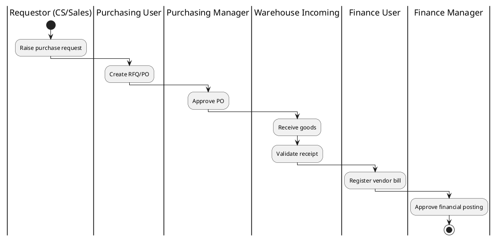
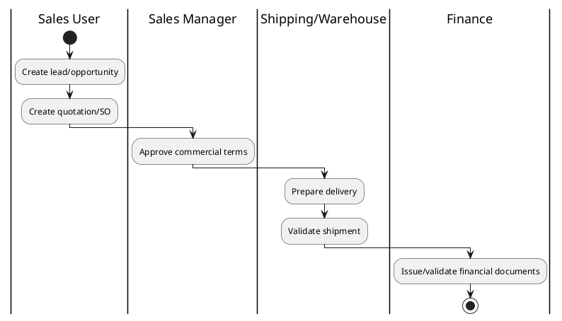

# Iconn User Menu & Process Flow Mapping (Post-Keith Review)

## Document Objective
This is an operational clarity document to:
1. Define which menus each role should use.
2. Define who starts, processes, approves, and closes each flow.
3. Eliminate duplicate work across departments.
4. Align process ownership with Keith review direction.

## Scope and Assumptions
1. This document is process/navigation guidance, not a technical security spec.
2. Menu ownership follows current role separation initiative.
3. Some roles are defined but not fully staffed yet; ownership is still documented to avoid future overlap.

## Section 1: Role-Based Menu Mapping

### 1.1 Core Operational Roles
| Role | Primary Menus | Secondary Menus | Not Allowed / Not Owner |
|---|---|---|---|
| Administrator | Settings, Users, Technical, All Apps | All reports | Not a day-to-day transaction owner |
| Customer Service / User | CRM, Sales Orders, Contacts/Companies | Delivery Orders (view), Customer activity reports | Purchase Orders, Vendor Bills, Stock valuation ownership |
| Customer Service / Manager | CRM, Sales Orders, Contacts/Companies approval steps | Customer pipeline and service reports | PO execution, warehouse execution |
| Sales Team / User | CRM Leads, Quotations, Sales Orders | Sales dashboard | Purchasing execution, warehouse validation |
| Sales Team / Country Manager | CRM, Sales Orders, Team pipeline | Team sales reporting | PO execution, warehouse task execution |
| Shipping / User | Inventory: Incoming/Outgoing operations (as assigned), Delivery processing | Delivery status tracking | PO commercial approval, finance posting |
| Shipping / Manager | Sales Ops views, PO operational follow-up, Inventory manager menus | Cross-functional operational reports | Finance final accounting approvals |
| Purchasing / User | Purchase Orders, RFQ, Vendor management | Incoming shipments coordination, supplier reports | Sales quotation ownership |
| Purchasing / Manager | Purchase Orders, Approvals, Supplier performance | Purchasing analytics | Customer service ticket ownership |
| Warehouse / Incoming Only | Inventory: Receipts | Putaway/inbound checks | Outgoing validation (unless explicitly assigned) |
| Warehouse / Outgoing Only | Inventory: Delivery Orders | Pick/pack/ship tracking | Inbound receiving ownership |
| Warehouse / Manager | Inventory operations, Replenishment, Internal Transfers | Inventory performance reports | Finance posting ownership |
| Finance / User | Vendor Bills, Invoicing (AP scope), Payments processing | Finance operation reports | Sales/warehouse transaction ownership |
| Finance / Manager | Accounting, Invoicing, Approvals, Credit note control | Finance managerial reporting | Warehouse transaction ownership |
| HR / User | Employees (limited), Leave, Expenses (policy-based) | HR admin reports (limited) | Payroll confidential data unless explicit payroll role |
| HR / Assistant Manager | Employees, Leave, Expense oversight (as assigned) | HR operational reports | Finance posting ownership |
| HR / Manager | HR management menus | HR managerial reports | Commercial transaction ownership |

### 1.2 Defined but Pending Detailed Menu Finalization
| Role | Current Position |
|---|---|
| Solution Engineering Cluster (FAE) / Manager, User | Keep to relevant project/presales menus only after explicit sign-off |
| Marketing / Manager, User | Keep to marketing campaign/reporting menus after explicit sign-off |
| Product Manager / Manager, User | Keep to product control menus after explicit sign-off |
| Quote Team / Manager, User | Keep to quotation workflow menus after explicit sign-off |
| Quality / Manager, User | Keep to quality checks/nonconformance menus after explicit sign-off |
| IT / Manager, User | Keep to system support menus only (no business transaction ownership) |

## Section 2: Process Flows (Ownership by Step)

### 2.1 Order-to-Fulfilment Flow (Sales to Delivery)
1. Initiate: Sales Team / User creates lead, quotation, and sales order.
2. Confirm commercial terms: Sales Team / Country Manager reviews/approves commercial side.
3. Fulfilment execution: Shipping/Warehouse executes picking, packing, and delivery.
4. Delivery confirmation: Warehouse/Shipping confirms delivery completion.
5. Financial closure: Finance validates billing impact and accounting records.

Owner by step:
1. Sales
2. Sales Manager
3. Shipping/Warehouse
4. Shipping/Warehouse
5. Finance

### 2.2 Procurement Flow (Request to Vendor Bill)
1. Need identified: Customer Service or Sales raises purchase need/request (trigger only).
2. PO creation: Purchasing / User creates RFQ/PO.
3. PO approval: Purchasing / Manager approves PO.
4. Goods receipt: Warehouse Incoming team validates receipt.
5. Vendor bill processing: Finance / User validates vendor bill.
6. Final financial approval: Finance / Manager closes accounting approval.

Owner by step:
1. Requesting department (trigger)
2. Purchasing
3. Purchasing Manager
4. Warehouse Incoming
5. Finance User
6. Finance Manager

### 2.3 Contact/Company Master Data Flow
1. Create draft company/contact: Customer Service (or Sales per scope).
2. Company review and approval: Customer Service Manager (and designated approver role where required).
3. Tax data update (approved companies): Finance Manager scope only (controlled update).
4. Usage in transactions: Sales/Purchasing/Finance reference approved master data.

Owner by step:
1. CS/Sales
2. CS Manager
3. Finance Manager
4. Transaction owner department

## Section 3: Process Flow Diagrams (PlantUML)

### 3.1 Procurement Swimlane (Post-Keith)

### 3.2 Order Fulfilment Swimlane

## Section 4: Duplicate Work Risk Areas and Control

### 4.1 Customer Service vs Purchasing Overlap
Risk:
1. CS creates and also executes PO, causing rework and ownership conflict.

Single Source of Truth:
1. CS can only trigger purchase request.
2. Purchasing owns RFQ/PO lifecycle.

### 4.2 Warehouse vs Shipping Overlap
Risk:
1. Both teams update same delivery steps without step ownership.

Single Source of Truth:
1. Shipping owns coordination/status communication.
2. Warehouse owns physical validation steps (receipt/delivery operations).

### 4.3 Report Export Duplication
Risk:
1. Multiple teams export the same report and manually reconcile different Excel versions.

Single Source of Truth:
1. Each report has one owning department and one official export owner.
2. Shared dashboards preferred over offline spreadsheets.

### 4.4 Manual Excel Manipulation Duplication
Risk:
1. Teams maintain parallel trackers for status and approvals.

Single Source of Truth:
1. Odoo document status is authoritative.
2. Excel is for presentation only, not status control.

## Section 5: Updated Flow After Keith Feedback

### Previous Approach
1. Customer Service handled purchasing and fulfilment-related execution steps.
2. Ownership boundaries were mixed across CS, Purchasing, and Warehouse.

### Updated Approach (Aligned to Keith)
1. Customer Service:
   - Owns customer-facing initiation and follow-up.
   - Triggers purchase request only.
2. Purchasing:
   - Owns RFQ/PO creation, update, and approval workflow.
3. Warehouse/Shipping:
   - Owns physical receipt/delivery execution.
4. Finance:
   - Owns vendor bill validation and accounting closure.

Outcome:
1. One owner per process step.
2. Fewer duplicate transactions.
3. Cleaner audit trail.

## Section 6: Responsibility Assignment Matrix (RACI-lite)
| Process Step | Responsible | Approver | Consulted | Informed |
|---|---|---|---|---|
| Create Sales Order | Sales User | Sales Manager | CS | Shipping, Finance |
| Raise Purchase Request | CS/Sales | Department Manager | Purchasing | Finance |
| Create PO | Purchasing User | Purchasing Manager | Requestor | Warehouse |
| Receive Goods | Warehouse Incoming | Warehouse/Shipping Manager | Purchasing | Finance |
| Process Vendor Bill | Finance User | Finance Manager | Purchasing | Requestor |
| Approve Company Master | CS Manager | Designated Approver/Admin | Finance | Sales, Purchasing |

## Section 7: Review Checklist for Keith
1. Does each process step have exactly one owner?
2. Is CS no longer executing purchasing transactions?
3. Are warehouse and shipping responsibilities separated by execution vs coordination?
4. Is finance the final owner of bill/accounting closure?
5. Are report owners clearly assigned to avoid duplicate exports?

## Section 8: Implementation Note
1. This document defines operational intent.
2. Any menu/flow mismatch in system behavior should be resolved by role-group and record-rule updates.
